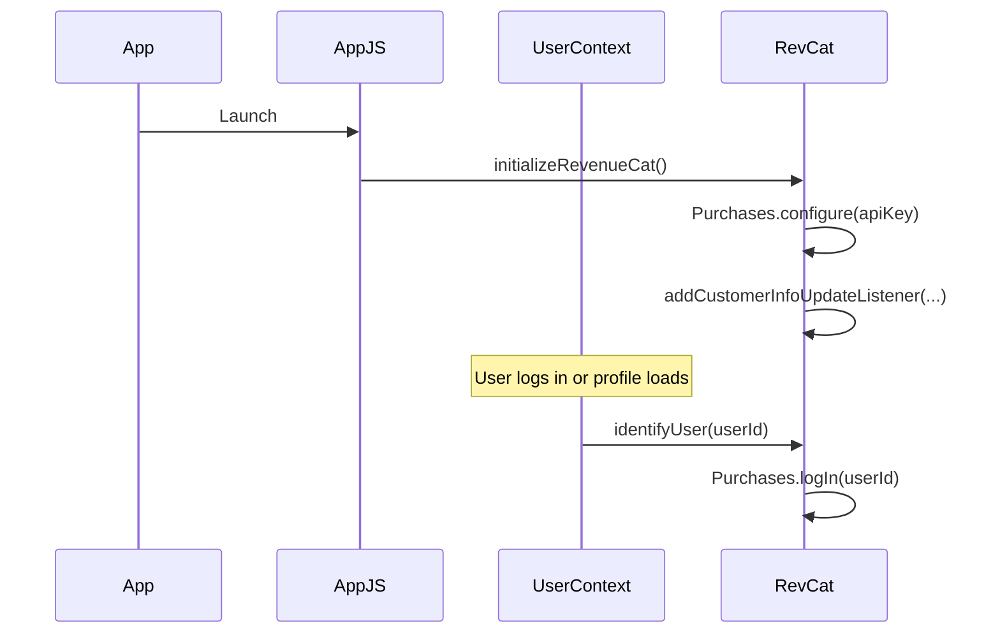
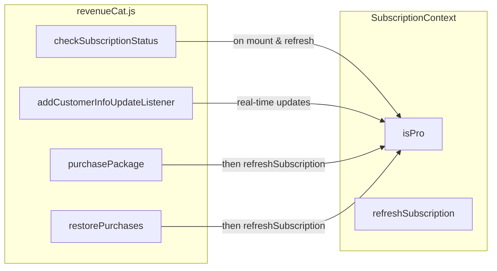
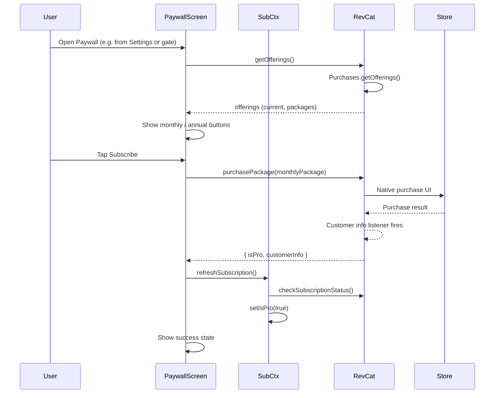

# Nomad — Technical Documentation

This document describes the tech stack, app architecture, and **RevenueCat implementation** for Nomad. RevenueCat is the centerpiece of our monetization and subscription logic.

---

## Tech Stack

| Layer | Technology |
|-------|------------|
| **Framework** | Expo (~54) + React Native |
| **Navigation** | React Navigation (stack + bottom tabs) |
| **Backend / Data** | Firebase (Auth, Firestore, Storage) |
| **Maps** | react-native-maps + Google Maps API |
| **Subscriptions & Monetization** | **RevenueCat** (`react-native-purchases` v8) |
| **State** | React Context (User, Subscription, Posts, Helpers, etc.) |
| **UI** | Custom theme + Tamagui, expo-image, expo-linear-gradient |

---

## High-Level Architecture (RevenueCat at the Center)

RevenueCat sits between the app’s subscription state and every feature that depends on “Pro” access. The diagram below shows how it connects to the rest of the app.

```mermaid
flowchart TB
    subgraph App["Nomad App"]
        UI[ Screens & Components ]
        SubCtx[ SubscriptionContext ]
        RevCat[ revenueCat.js ]
    end

    subgraph RevenueCat["RevenueCat (Cloud)"]
        RC_API[ RevenueCat API ]
        Entitlements[ Entitlements: pro ]
        Offerings[ Offerings / Packages ]
    end

    subgraph Stores["App Stores"]
        iOS[ App Store ]
        Android[ Google Play ]
    end

    UI -->| useSubscription() | SubCtx
    SubCtx -->| checkSubscriptionStatus, listener | RevCat
    RevCat <-->| SDK: getCustomerInfo, purchase, restore | RC_API
    RC_API --> Entitlements
    RC_API --> Offerings
    RevCat -.->| Native purchase flow | iOS
    RevCat -.->| Native purchase flow | Android
```

**Flow in words:**  
Screens and components read `isPro` from `SubscriptionContext`. That context gets Pro status from our `revenueCat.js` service, which talks to the RevenueCat SDK. RevenueCat syncs with the App Store / Google Play and exposes **entitlements** (we use one: `pro`) and **offerings** (monthly / annual packages). Purchases and restores go through the native stores; RevenueCat then updates entitlements and our listener pushes the new state into the app.

---

## RevenueCat Implementation (Centerpiece)

### 1. Initialization & User Identity

RevenueCat is initialized once at app startup and is tied to the logged-in user for accurate subscription tracking.



- **Where:** `App.js` calls `initializeRevenueCat()` in a `useEffect` on mount.
- **User identity:** When the user is set or updated in `UserContext`, we call `identifyUser(userId)` so RevenueCat associates subscription data with that user. On logout, we call `logoutUser()`.

### 2. Entitlement Model

We use a **single entitlement**: `pro`.

| Entitlement | Purpose |
|-------------|--------|
| `pro` | Unlocks Helpers (post/respond), enhanced map (pins), creating posts, and any other gated features. |

Pro status is derived in code by:

```js
const proEntitlement = customerInfo.entitlements.active[PRO_ENTITLEMENT_IDENTIFIER];
const isPro = proEntitlement !== undefined;
```

All subscription checks in the app use this single `isPro` flag from `SubscriptionContext`.

### 3. SubscriptionContext — Single Source of Truth

`SubscriptionContext` is the only place the app gets “is this user Pro?” from RevenueCat.



- **On mount:** The context calls `checkSubscriptionStatus()` and registers `addCustomerInfoUpdateListener`. RevenueCat’s listener fires when subscription state changes (purchase, renewal, cancellation, restore).
- **Exposed API:** `isPro`, `isLoading`, `subscriptionInfo`, `refreshSubscription`. Any screen or component that needs to gate or show Pro content uses `useSubscription()`.

### 4. RevenueCat Service API

| Function | Purpose |
|----------|---------|
| `initializeRevenueCat()` | Configure SDK with platform-specific API key; attach global customer-info listener. |
| `identifyUser(userId)` | Link RevenueCat to the current user (called from UserContext). |
| `logoutUser()` | Clear RevenueCat user (on logout). |
| `checkSubscriptionStatus()` | Fetch `Purchases.getCustomerInfo()`, compute `isPro` from `entitlements.active['pro']`. |
| `addCustomerInfoUpdateListener(cb)` | Subscribe to RevenueCat customer-info updates; used by SubscriptionContext. |
| `getOfferings()` | Fetch current offerings (e.g. default with monthly/annual packages). |
| `purchasePackage(package)` | Run native purchase; return updated customerInfo and Pro status. |
| `restorePurchases()` | Restore previous purchases; return updated customerInfo and Pro status. |

All of these live in `src/services/revenueCat.js`. The entitlement identifier is the constant `PRO_ENTITLEMENT_IDENTIFIER = 'pro'`.

### 5. Paywall & Purchase Flow

The Paywall screen is the main RevenueCat-facing UI: it loads offerings, displays packages, and handles purchase and restore.



- **Offerings:** We use `offerings.current` and pick packages by identifier (`monthly`, `annual`) for display and purchase.
- **After purchase or restore:** We call `refreshSubscription()` so SubscriptionContext updates; we also show a success view with Pro benefits. If the user was already Pro (e.g. opened Paywall from Settings), we show the same success/benefits view without purchase UI.
- **Restore:** Settings and Paywall both expose “Restore purchases”; they call `restorePurchases()` then `refreshSubscription()` and handle the result (e.g. “No purchases found” vs. success).

### 6. Where Pro Is Gated (Paywall as Fallback)

These are the places that check `isPro` and send the user to the Paywall when they need Pro but aren’t subscribed:

| Location | Action gated | Behavior if not Pro |
|----------|------------------|----------------------|
| **CreatePostScreen** | Creating a post | Alert with “Upgrade” → navigate to Paywall. |
| **CreatePinForm** | Creating a map pin | Alert with “Upgrade” → navigate to Paywall. |
| **LoginScreen** | Post-login (e.g. first-time or returning) | Optional prompt to go to Paywall if not Pro. |
| **SettingsScreen** | Viewing subscription status | Shows “Not subscribed” / “Active”; row opens Paywall. |
| **PaywallScreen** | N/A | Entry point for purchase/restore; shows success when `isPro`. |

Helpers (create request / respond) are the main monetized feature; the same pattern can be applied there (check `isPro` before allowing create or respond, and navigate to Paywall if needed).

```mermaid
flowchart TD
    A[ User tries gated action ]
    A --> B{ useSubscription().isPro? }
    B -->| Yes | C[ Allow action ]
    B -->| No | D[ Alert: Upgrade to Pro ]
    D --> E[ navigation.navigate('Paywall') ]
    E --> F[ User purchases or restores ]
    F --> G[ SubscriptionContext updates ]
    G --> B
```

---

## App Architecture (Slim Overview)

- **Navigation:** `AppNavigator` → auth vs main stack; main uses `TabNavigator` (Community, Map, Helpers, Profile) and `StackNavigator` for modals and detail screens (e.g. PostDetail, Paywall, HelperRequestDetail).
- **Providers:** `UserProvider`, `SubscriptionProvider`, and feature providers (Posts, Helpers, Pins, etc.) wrap the app; `SubscriptionProvider` wraps the main app so every screen can call `useSubscription()`.
- **RevenueCat:** Initialized in `App.js`; user identity in `UserContext`; subscription state in `SubscriptionContext`; purchase/restore/offerings in `PaywallScreen` and `revenueCat.js`.

---

## Summary

- **Tech stack:** Expo/React Native, Firebase, React Navigation, **RevenueCat** (`react-native-purchases`) for subscriptions.
- **Architecture:** RevenueCat is the single source of subscription truth: the SDK talks to the stores, exposes entitlements and offerings, and our `revenueCat.js` + `SubscriptionContext` expose `isPro` to the whole app.
- **RevenueCat usage:** One entitlement (`pro`), user identification on login/logout, real-time updates via customer-info listener, Paywall for getOfferings / purchasePackage / restorePurchases, and Pro gating on create post, create pin, and settings, with Paywall as the upgrade path.

This keeps subscription logic centralized and makes RevenueCat the clear centerpiece of our hackathon implementation.
